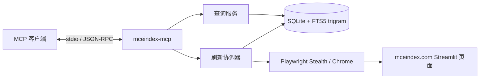

# MCEIndex MCP

面向 [有意义中国经济指数（mceindex.com）](https://mceindex.com/) 的本地索引 MCP 服务。服务使用 Playwright 与浏览器 stealth 补丁渲染公开 Streamlit 页面，将指标卡、统计期、解释文本和 Plotly 图表序列结构化写入 SQLite，并通过标准输入输出暴露类型化 MCP 工具。

这不是 mceindex.com 的官方 API，也不绕过访问控制。数据以页面实际公开内容和最近一次成功抓取为准；回答经济问题时应保留结果中的 `sourceUrl` 与 `fetchedAt`。

## 设计



- 首个查询会刷新一次索引；同一 MCP 进程内的后续查询只读本地 SQLite。
- 刷新失败但本地已有数据时返回旧索引；空库返回 `INDEX_EMPTY`。
- `refresh_index` 用于显式更新，支持 24 小时刷新间隔和 60 秒硬冷却。
- SQLite FTS5 trigram 支持中文子串、指标代码和内容类型过滤。
- 页面、指标卡、表格和 Plotly 图表均以结构化数据保存并通过 MCP JSON Schema 返回。
- 单页失败不会删除上次成功内容；每次刷新结束后关闭浏览器。

## 安装

### 1. 安装系统依赖

同一个 `MCEIndex.Mcp` 工具包可用于 Windows、Linux 和 macOS，不需要下载不同平台的 `.nupkg`。工具包不会重复打包以下系统组件，用户需要先自行安装：

| 依赖 | Windows | Linux | macOS |
|---|---|---|---|
| [.NET 10](https://dotnet.microsoft.com/download/dotnet/10.0) | SDK；仅运行现成包时 Runtime 即可 | SDK；仅运行现成包时 Runtime 即可 | SDK；仅运行现成包时 Runtime 即可 |
| [Node.js 24 LTS](https://nodejs.org/) | 必须，确保 `node.exe` 位于 `PATH` | 必须，确保 `node` 位于 `PATH` | 必须，确保 `node` 位于 `PATH` |
| SQLite 3 | Windows 10+ 自带 `winsqlite3.dll` | 安装提供 `libsqlite3.so.0` 的发行版运行库 | 系统自带 `libsqlite3.dylib` |
| Chrome 或 Chromium | 安装任一种 | 安装任一种 | 安装任一种 |

请通过各平台的官方安装程序或系统包管理器安装上述依赖。安装后，所有平台都先确认 .NET 和 Node.js 可用：

```text
dotnet --version
node --version
```

浏览器不在标准安装位置时，后续在 MCP 配置中设置 `MCEINDEX_BROWSER_EXECUTABLE`；Node.js 不在 MCP 客户端的 `PATH` 中时设置 `PLAYWRIGHT_NODEJS_PATH`。这两个变量在三个平台上都接受可执行文件的绝对路径。

### 2. 生成并安装本地 `.nupkg`

本项目不要求把包发布到在线包管理器。依赖准备完成后，在 Windows、Linux 或 macOS 的仓库目录执行相同的 .NET 命令：

```text
dotnet restore
dotnet pack src/MceIndex.Mcp/MceIndex.Mcp.csproj -c Release -o artifacts
dotnet tool install --tool-path "<TOOL_PATH>" --add-source ./artifacts MCEIndex.Mcp --version 3.6.0
```

执行前将 `<TOOL_PATH>` 替换为希望保存工具的绝对目录，例如：

| 平台 | `<TOOL_PATH>` 示例 | 安装后的 `command` |
|---|---|---|
| Windows | `C:\Users\USER\AppData\Local\mceindex-mcp` | `C:\Users\USER\AppData\Local\mceindex-mcp\mceindex-mcp.exe` |
| Linux | `/home/USER/.local/share/mceindex-mcp` | `/home/USER/.local/share/mceindex-mcp/mceindex-mcp` |
| macOS | `/Users/USER/.local/share/mceindex-mcp` | `/Users/USER/.local/share/mceindex-mcp/mceindex-mcp` |

该命令不依赖 shell 续行语法，可直接用于 PowerShell、CMD、bash 和 zsh。

### 3. 验证安装

```text
dotnet tool list --tool-path "<TOOL_PATH>"
```

输出应包含 `mceindex.mcp 3.6.0`。MCP 客户端的 `command` 使用上表中的绝对可执行文件路径。

### 更新或卸载

```text
dotnet tool update --tool-path "<TOOL_PATH>" --add-source ./artifacts MCEIndex.Mcp --version 3.6.0 --no-cache
dotnet tool uninstall --tool-path "<TOOL_PATH>" MCEIndex.Mcp
```

`.nupkg` 只保存在本地 `artifacts` 目录，不需要上传 NuGet.org。首次 `restore`/`pack` 仍需从已配置的依赖源取得第三方包；已经缓存依赖时可以离线构建。工具运行时复用第 1 步安装的 Node.js、SQLite 和 Chrome，不会在 `.nupkg` 中重复保存这些运行时。


### 开发运行

开发时无需全局安装：

```bash
dotnet run --project src/MceIndex.Mcp/MceIndex.Mcp.csproj
```

进程通过 stdio 传输 MCP JSON-RPC；stdout 专用于协议，运行日志写入 stderr。

## MCP 客户端配置

从本地 `.nupkg` 安装后，Claude Desktop 等客户端将 `command` 设置为安装步骤表格中的绝对路径：

```json
{
  "mcpServers": {
    "mceindex": {
      "command": "ABSOLUTE_PATH_TO_MCEINDEX_MCP"
    }
  }
}
```

Codex 配置使用同一个绝对路径：

```toml
[mcp_servers.mceindex]
command = "ABSOLUTE_PATH_TO_MCEINDEX_MCP"
startup_timeout_sec = 60
tool_timeout_sec = 180
```

Node.js 已在客户端 `PATH` 中、Chrome 位于标准安装位置时，不需要额外环境变量。自动探测失败时再添加：

```text
PLAYWRIGHT_NODEJS_PATH=<Node.js 可执行文件绝对路径>
MCEINDEX_BROWSER_EXECUTABLE=<Chrome 或 Chromium 可执行文件绝对路径>
```

Windows 使用 `node.exe`、`chrome.exe` 路径；Linux 和 macOS 使用对应的 `node`、Chrome 或 Chromium 可执行文件路径。

## 工具

同一 MCP 进程的首个查询会刷新索引，后续查询只读本地数据。

| 工具 | 用途 | 主要参数 |
|---|---|---|
| `get_latest` | 返回月度总览的六组最新读数 | 无 |
| `get_indicator` | 按代码或中文名称读取指标 | `indicator` |
| `list_pages` | 列出已索引栏目和刷新状态 | 无 |
| `get_page` | 读取栏目摘要、正文、表格或图表 | `page`、`view`、`offset`、`limit` |
| `search_index` | 搜索中文内容或指标代码 | `query`、`page`、`kind`、`mode`、`offset`、`limit` |
| `refresh_index` | 手动刷新全部栏目 | `force=false` |

`get_latest` 的读数包含网站值、统计期、来源和可选核验信息。`get_page` 与 `search_index` 使用 `offset`/`limit` 分页。

`refresh_index(force=false)` 遵守 24 小时间隔；`force=true` 可绕过该间隔，但不能绕过 60 秒硬冷却。结果为 `completed`、`partial` 或 `skipped`。

## 配置

| 环境变量 | 默认值 | 用途 |
|---|---|---|
| `MCEINDEX_BASE_URL` | `https://mceindex.com/` | 数据源地址；HTTP 只允许本机测试 |
| `MCEINDEX_DB_PATH` | 平台缓存目录下的 `mceindex_mcp/mceindex.db` | SQLite 索引路径 |
| `MCEINDEX_BROWSER_EXECUTABLE` | 自动探测 | Chrome/Chromium 绝对路径 |
| `PLAYWRIGHT_NODEJS_PATH` | 从 `PATH` 探测 | Node.js 绝对路径 |
| `MCEINDEX_BROWSER_USER_AGENT` | 内置 Chrome UA | 自定义浏览器 User-Agent |
| `MCEINDEX_BROWSER_PROFILE` | 空 | 可选持久化浏览器 profile |
| `MCEINDEX_CF_CLEARANCE` | 空 | 可选的合法 `cf_clearance` Cookie |
| `MCEINDEX_HEADLESS` | `true` | 是否无头运行 |
| `MCEINDEX_TIMEOUT_MS` | `45000` | 单页超时 |
| `MCEINDEX_SETTLE_MS` | `1200` | DOM 稳定等待时间 |
| `MCEINDEX_REFRESH_INTERVAL_MS` | `86400000` | 普通刷新间隔 |
| `MCEINDEX_CRAWL_DELAY_MS` | `3000` | 页面请求间隔 |
| `MCEINDEX_CRAWL_CONCURRENCY` | `1` | 抓取并发，范围 1–4 |
| `MCEINDEX_MAX_PAGES` | `20` | 单次刷新页面上限，范围 5–100 |

Cloudflare 验证失败返回 `ACCESS_CHALLENGE`。其他稳定错误码包括 `BROWSER_NOT_FOUND`、`LOAD_TIMEOUT`、`PAGE_NOT_FOUND`、`INDICATOR_NOT_FOUND`、`INDEX_EMPTY`、`INVALID_CONFIGURATION`、`EXTRACTION_FAILED`、`DATABASE_ERROR` 和 `INTERNAL_ERROR`。

## 数据库

SQLite schema v4 保存页面、指标卡、内容、FTS 索引和刷新状态。旧版 v2/v3 数据库会在启动时原地迁移；启动迁移本身不访问网络。

## 开发与验证

```bash
dotnet restore
dotnet build MceIndex.slnx --no-restore
dotnet test MceIndex.slnx --no-restore
dotnet pack src/MceIndex.Mcp/MceIndex.Mcp.csproj -c Release --no-restore -o artifacts
```
浏览器集成测试需要设置 `MCEINDEX_TEST_BROWSER`，其余测试不依赖外部浏览器。
