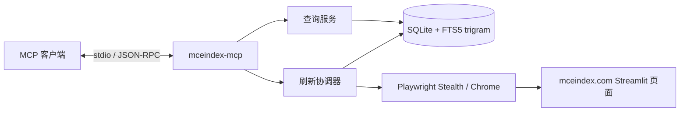

# MCEIndex MCP

面向 [有意义中国经济指数（mceindex.com）](https://mceindex.com/) 的本地索引 MCP 服务。服务使用 Playwright 与浏览器 stealth 补丁渲染公开 Streamlit 页面，将指标卡、统计期、解释文本和 Plotly 图表序列结构化写入 SQLite，并通过标准输入输出暴露类型化 MCP 工具。

这不是 mceindex.com 的官方 API，也不绕过访问控制。数据以页面实际公开内容和最近一次成功抓取为准；回答经济问题时应保留结果中的 `sourceUrl` 与 `fetchedAt`。

## 设计



- **会话首次刷新**：同一个 MCP 服务进程中的首个查询工具调用执行一次全量刷新；并发首调用共享同一任务，刷新结束后才查询 SQLite。
- **后续仅查本地**：该进程后续的 `get_*`、`list_pages`、`search_index` 不再访问网络，即使索引状态已过期也直接返回本地数据。
- **离线回退**：首次刷新失败但已有索引时继续返回上次成功数据；数据库为空时返回 `INDEX_EMPTY`，不会在每次查询时自动重试。
- **显式更新**：只有 `refresh_index` 能在会话初始化后再次抓取；`force=false` 遵守 24 小时间隔，`force=true` 可绕过该间隔，但不能绕过 60 秒硬冷却。
- **增量提交**：全量扫描后按页面规范化语义内容计算 SHA-256；未变化页面只更新检查时间，不重写内容或 FTS。
- **故障隔离**：单页失败不会删除该页上次成功内容；一次刷新最多重试可恢复错误 3 次。
- **双层单航班**：并发首查询共享会话初始化任务，并发显式刷新共享抓取任务；每次抓取结束后关闭浏览器。
- **结构化数据**：核心卡片包含代码、值、统计期、比较口径和逐项解释；图表包含标题、解释、坐标轴、序列和数据点。
- **交互数据覆盖**：抓取器激活所有可见 `All` 历史区间，滚动初始化懒加载图表，并遍历“五大新产业续命指数”的 5 个视图及“行业下钻”的 5 个行业；初始状态中的补充图表与全历史状态合并保留。
- **资源边界**：每页最多处理 32 份 HTML、单份 500 万字符、合计 2000 万字符；图表最多 32 张、每图 32 个序列、单序列 10000 点且每页合计 100000 点，超限返回 `EXTRACTION_FAILED`。
- **中文搜索**：SQLite FTS5 trigram 支持中文子串、英文指标代码、图表解释、栏目与内容类型过滤。
- **结构化输出**：所有工具声明 JSON Schema，并同时返回 MCP `structuredContent` 和兼容文本内容。

这里的“会话”是一个 MCP stdio 连接对应的服务进程生命周期。MCP 协议没有标准对话 ID；若客户端跨多个聊天复用同一进程，这些聊天会共享一次会话刷新。需要严格按聊天刷新时，客户端应在新对话时重启该 MCP 进程。

## 安装

### 1. 安装系统依赖

同一个 `MCEIndex.Mcp` 工具包可用于 Windows、Linux 和 macOS，不需要下载不同平台的 `.nupkg`。工具包不会重复打包以下系统组件，用户需要先自行安装：

| 依赖 | Windows | Linux | macOS |
|---|---|---|---|
| [.NET 10](https://dotnet.microsoft.com/download/dotnet/10.0) | SDK；仅运行现成包时 Runtime 即可 | SDK；仅运行现成包时 Runtime 即可 | SDK；仅运行现成包时 Runtime 即可 |
| [Node.js 24 LTS](https://nodejs.org/) | 必须，确保 `node.exe` 位于 `PATH` | 必须，确保 `node` 位于 `PATH` | 必须，确保 `node` 位于 `PATH` |
| SQLite 3 | Windows 10+ 自带 `winsqlite3.dll` | 安装提供 `libsqlite3.so.0` 的发行版运行库 | 系统自带 `libsqlite3.dylib` |
| Chrome 或 Chromium | 安装任一种 | 安装任一种 | 安装任一种 |

请通过各平台的官方安装程序或系统包管理器安装上述依赖。安装后，所有平台都先确认 .NET 和 Node.js 可用：

```text
dotnet --version
node --version
```

浏览器不在标准安装位置时，后续在 MCP 配置中设置 `MCEINDEX_BROWSER_EXECUTABLE`；Node.js 不在 MCP 客户端的 `PATH` 中时设置 `PLAYWRIGHT_NODEJS_PATH`。这两个变量在三个平台上都接受可执行文件的绝对路径。

### 2. 生成并安装本地 `.nupkg`

本项目不要求把包发布到在线包管理器。依赖准备完成后，在 Windows、Linux 或 macOS 的仓库目录执行相同的 .NET 命令：

```text
dotnet restore
dotnet pack src/MceIndex.Mcp/MceIndex.Mcp.csproj -c Release -o artifacts
dotnet tool install --tool-path "<TOOL_PATH>" --add-source ./artifacts MCEIndex.Mcp --version 3.6.0
```

执行前将 `<TOOL_PATH>` 替换为希望保存工具的绝对目录，例如：

| 平台 | `<TOOL_PATH>` 示例 | 安装后的 `command` |
|---|---|---|
| Windows | `C:\Users\USER\AppData\Local\mceindex-mcp` | `C:\Users\USER\AppData\Local\mceindex-mcp\mceindex-mcp.exe` |
| Linux | `/home/USER/.local/share/mceindex-mcp` | `/home/USER/.local/share/mceindex-mcp/mceindex-mcp` |
| macOS | `/Users/USER/.local/share/mceindex-mcp` | `/Users/USER/.local/share/mceindex-mcp/mceindex-mcp` |

该命令不依赖 shell 续行语法，可直接用于 PowerShell、CMD、bash 和 zsh。

### 3. 验证安装

```text
dotnet tool list --tool-path "<TOOL_PATH>"
```

输出应包含 `mceindex.mcp 3.6.0`。MCP 客户端的 `command` 使用上表中的绝对可执行文件路径。

### 更新或卸载

```text
dotnet tool update --tool-path "<TOOL_PATH>" --add-source ./artifacts MCEIndex.Mcp --version 3.6.0 --no-cache
dotnet tool uninstall --tool-path "<TOOL_PATH>" MCEIndex.Mcp
```

`.nupkg` 只保存在本地 `artifacts` 目录，不需要上传 NuGet.org。首次 `restore`/`pack` 仍需从已配置的依赖源取得第三方包；已经缓存依赖时可以离线构建。工具运行时复用第 1 步安装的 Node.js、SQLite 和 Chrome，不会在 `.nupkg` 中重复保存这些运行时。


### 开发运行

开发时无需全局安装：

```bash
dotnet run --project src/MceIndex.Mcp/MceIndex.Mcp.csproj
```

进程通过 stdio 传输 MCP JSON-RPC；stdout 专用于协议，运行日志写入 stderr。

## MCP 客户端配置

从本地 `.nupkg` 安装后，Claude Desktop 等客户端将 `command` 设置为安装步骤表格中的绝对路径：

```json
{
  "mcpServers": {
    "mceindex": {
      "command": "ABSOLUTE_PATH_TO_MCEINDEX_MCP"
    }
  }
}
```

Codex 配置使用同一个绝对路径：

```toml
[mcp_servers.mceindex]
command = "ABSOLUTE_PATH_TO_MCEINDEX_MCP"
startup_timeout_sec = 60
tool_timeout_sec = 180
```

Node.js 已在客户端 `PATH` 中、Chrome 位于标准安装位置时，不需要额外环境变量。自动探测失败时再添加：

```text
PLAYWRIGHT_NODEJS_PATH=<Node.js 可执行文件绝对路径>
MCEINDEX_BROWSER_EXECUTABLE=<Chrome 或 Chromium 可执行文件绝对路径>
```

Windows 使用 `node.exe`、`chrome.exe` 路径；Linux 和 macOS 使用对应的 `node`、Chrome 或 Chromium 可执行文件路径。

## 工具
同一个 MCP 服务进程中，下面五个查询工具的首次调用会先刷新一次数据；之后仅查询本地 SQLite。它们因此可能在首次调用时产生网络和本地缓存写入，MCP 工具元数据将其声明为非只读、非破坏、幂等。


### `get_latest`

直接返回与网站“月度总览”首屏一致的六组、27个结构化读数。每个 reading 提供稳定 `key`、中文 `label`、数值 `value`、网站展示值 `displayValue`、单位 `unit` 以及逐项 `verification`。`verification` 区分结论可信度、原始来源、算法披露、复现程度和外部同值，附公式、复算过程、权威来源及限制条件；有关读数还包含独立的 `conceptualProvenance`，用于记录发布方材料能支持的指标动机，不把方法思想误作数值验证。审计限定 `auditedPeriod`；当网站进入新月份时 `appliesToCurrentPeriod=false` 且数值状态自动变为 `notAssessed`，不会套用旧结论。分区 `notes` 继续保留网站原始公式、数据依赖、研究口径和限制文本。无参数。

#### 可信度标签

`verification` 不是对网站整体背书，而是对单个读数在指定月份的可核验程度进行分层：

| 字段 | 枚举或含义 |
|---|---|
| `status` | `verified`：官方原值或完整复算；`partiallyVerified`：只有部分输入或条件复算；`notFound`：决定性底表缺失；`unverifiedEstimate`：来源和估算方法均不足；`notAssessed`：当前月份尚未审计 |
| `sourceStatus` | `verified`、`partial`、`missing`、`notAssessed` |
| `algorithmStatus` | `published`、`inferred`、`missing`、`notApplicable`、`notAssessed` |
| `reproductionStatus` | `verified`、`conditional`、`impossible`、`directSource`、`notAssessed` |
| `independentExactMatch` | MCEIndex 之外是否存在同口径、同期间、同数值 |
| `auditedPeriod` | 本项目实际核验的月份；当前为 `2026-06` |
| `appliesToCurrentPeriod` | 标签是否适用于当前 reading 的统计期 |
| `formula` / `reproduction` | 已发布或标有 `[INFERENCE]` 的公式，以及代入数值后的复算 |
| `sources` / `limitations` | 原始机构链接和不能从数字本身消除的口径限制 |
| `conceptualProvenance` | 可选的指标级概念来源：`status`、动机摘要、发布方来源和局限；它与月份数值审计分离，不会提升 reading 的 `status` |

`conceptualProvenance.status=partiallyVerified` 只表示发布方材料能够解释“为什么提出这个问题或选择这组行业”。它不证明公式、输入、系数或最终读数，且在月份变化后仍可保留为指标级来源。


#### 2026-06 全部结论数据

下表覆盖 `get_latest` 当前返回的全部27个 reading。`MCE` 表示网站是结论发布方，不表示底层输入已经独立验证。

##### 新产业规模

| key | 网站值 | 算法与复现 | 数据来源 | 可信度 |
|---|---:|---|---|---|
| `industryScaleShare` | 10.90% | 已发布：$(\sum 五行业产业规模毛额-内部交易抵销)/月度GDP$；行业底表与月度GDP规则缺失 | MCE正式HS发布说明；国家统计局H1/Q2 GDP；FearNation E249仅支持选取动机 | `notFound` |
| `movingAverage12m` | 9.76% | 最近12个月产业规模占比算术平均；只能用MCE自身序列条件复现 | MCE历史图表 | `notFound` |
| `historicalPercentile` | P99 | `[INFERENCE]` 2026-06值在78个月中排名77，$77/78=98.718\%$；精确排名规则未披露 | MCE历史图表 | `notFound` |

`industryScaleShare` 的官方GDP参照来自[国家统计局2026年二季度和上半年GDP初步核算](https://www.stats.gov.cn/sj/zxfb/202607/t20260716_1964142.html)。缺失项包括五行业代码、HS映射、国内交付、人民币换算、内部抵销矩阵及6月单月GDP构造，因此不能从零复建10.90%。

[FearNation E249](https://www.youtube.com/watch?v=d5jEroGqoLc) 的标题、发布频道和方法论主题可由YouTube元数据确认；节目索引从“五大暴涨行业拆解”进入就业、税收和内需传导问题。关联材料列出新能源汽车、新能源、集成电路、生物医药和电气化设备，与MCE五产业近似对应，因此 `conceptualProvenance` 标为 `partiallyVerified`。但“生物医药”不等于页面的“医药制造”，不能据此认定统计边界一致；影片也没有提供生成10.90%所需的底表。

##### 就业

| key | 网站值 | 算法与复现 | 数据来源 | 可信度 |
|---|---:|---|---|---|
| `theoreticalEmploymentStock` | 833.8万人 | 已发布：$\sum(行业产业规模毛额\times直接就业密度)$；两类决定性输入均缺失 | MCE行业模型；E249仅支持就业传导问题的设计动机 | `notFound` |
| `employmentContribution` | 1.15% | `[INFERENCE]` $8,338,271/725,040,000=1.15004\%$ | MCE就业分子；国家统计局2025年末就业人员；E249仅支持语义来源 | `partiallyVerified` |
| `graduates2026` | 约1270万人 | 官方预计值，直接读取 | 教育部网站转载新华社 | `verified` |
| `rideHailingDrivers` | 约780万人 | 历史累计发证规模可确认；2026-06精确估算和注销/重复处理未知 | 交通运输部历史数据及2026-06月报 | `partiallyVerified` |
| `deliveryRiders` | 约1450万人 | 无法复算；未找到1450万唯一骑手的权威统计 | 中国就业网、美团公开材料 | `unverifiedEstimate` |

就业分母来自[国家统计局2025年统计公报](https://www.stats.gov.cn/sj/zxfbhjd/202602/t20260228_1962662.html)；毕业生来自[教育部](https://hudong.moe.gov.cn/jyb_xwfb/s5147/202606/t20260615_1440719.html)。外卖骑手的权威材料只支持“超过1000万人”等数量级；精确1450万同时出现在美团“年活跃商户”口径，存在指标错配风险。平台注册、年活跃、月有单、实际从业和跨平台去重不能混用。

E249在“暴涨利润为何不交税、不增就业”章节追问高利润行业的就业传导，能解释为何构造理论就业存量及其全国占比；它不提供行业就业人数、就业密度、人月转换或去重规则，因此833.8万人仍是核心黑箱。

##### 净财政及量级参照

| key | 网站值 | 算法与复现 | 数据来源 | 可信度 |
|---|---:|---|---|---|
| `annualizedNetFiscalContribution` | -946亿元 | 已发布：$12\times(毛税收现金-出口退税-直接补助-递延支持)$；四项底表缺失 | MCE财政模型；E249仅支持利润—税收传导问题的设计动机 | `notFound` |
| `fiscalContribution` | -0.52% | `[INFERENCE]` $-946/181,520=-0.52115\%$ | MCE分子；财政部2026税收收入预算；E249仅支持语义来源 | `partiallyVerified` |
| `defenseBudget` | 19,096亿元 | $round(19,095.61)$ | 财政部2026中央本级预算 | `verified` |
| `debtInterest` | 13,491亿元 | 官方表直接读取 | 财政部2025全国执行数 | `verified` |
| `educationSpending` | 43,417亿元 | 官方表直接读取 | 财政部2025全国执行数 | `verified` |
| `landSaleRevenue` | 41,518亿元 | 官方表直接读取 | 财政部2025地方政府性基金收入 | `verified` |
| `centralTransfers` | 104,150亿元 | 官方表直接读取 | 财政部2026中央对地方转移支付预算 | `verified` |

财政来源为[2025年财政收支执行情况](https://bgt.mof.gov.cn/zhuantilanmu/rdwyh/ysbgjyszx/202601/t20260130_3982923.htm)和[2026年预算报告](https://www.mof.gov.cn/zhengwuxinxi/caizhengxinwen/202603/t20260316_3985331.htm)。五个参照数本身可靠，但混合2025执行、2026预算、全国/中央、一般公共预算/政府性基金，只能比较量级，不能与-946亿元作同口径比例解释。

E249把工业利润增长与企业所得税弱增长并列，并追问利润为何没有转化为税收，因而加强了“净财政贡献”这一问题的概念来源；它没有披露毛税收、退税、补助和递延支持逐项金额，不改变-946亿元的 `notFound`。

##### 社零

| key | 网站值 | 算法与复现 | 数据来源 | 可信度 |
|---|---:|---|---|---|
| `meaningfulRetail` | +0.0% | 候选公式为$(1+名义同比)/(1+价格同比)-1$；平减项映射、权重和未舍入值缺失 | MCE比值法；国家统计局社零和CPI | `partiallyVerified` |
| `belowDesignated` | +3.2% | `[INFERENCE]` 由社零总额与限额以上本期/上年同期金额差额倒算 | 国家统计局社零金额 | `partiallyVerified` |
| `aboveDesignated` | -2.0% | 官方表直接读取 | 国家统计局 | `verified` |
| `durablesPropertyChain` | -10.475%（显示-10.5%） | `[INFERENCE]` $(-16.1-10.5-8.7-6.6)/4=-10.475\%$ | 国家统计局汽车、建材、家电、家具同比 | `partiallyVerified` |

社零原始值来自[国家统计局2026年6月社零数据](https://www.stats.gov.cn/sj/zxfb/202607/t20260715_1964127.html)。耐用品/地产链是MCE对四个官方分类同比的无权重简单平均，不是国家统计局正式指标；经济权重加总可能得到不同结果。

##### CPI/PPI

| key | 网站值 | 算法与复现 | 数据来源 | 可信度 |
|---|---:|---|---|---|
| `officialCpi` | 1.0% | 官方表直接读取 | 国家统计局 | `verified` |
| `meaningfulCpi` | 0.4%（研究值0.44%） | `[INFERENCE]` $1.00-0.49-0.09+0.02+0=0.44$ | 国家统计局CPI、上金所Au99.99、MCE调整项 | `partiallyVerified` |
| `officialPpi` | 4.1% | 官方表直接读取 | 国家统计局 | `verified` |
| `meaningfulPpi` | 1.0%（研究值1.04%） | `[INFERENCE]` $(1.20+0.89)/2=1.045$；子模型和舍入规则缺失 | 国家统计局PPI行业数据、MCE子模型 | `partiallyVerified` |

CPI来源为[国家统计局2026年6月CPI](https://www.stats.gov.cn/sj/zxfb/202607/t20260709_1964084.html)，黄金代理来自[上海黄金交易所2026年6月月报](https://www.sge.com.cn/upload/file/202607/02/9a1fd9b9be654e46a96d6e5a9754e638.pdf)，PPI来源为[国家统计局解读](https://www.stats.gov.cn/sj/zxfbhjd/202607/t20260709_1964083.html)。有意义CPI缺燃油权重、黄金历史校准、鲜食权重和租金绑定；有意义PPI缺两个子模型的行业清单、固定权重及基期。

##### 社融

| key | 网站值 | 算法与复现 | 数据来源 | 可信度 |
|---|---:|---|---|---|
| `meaningfulSocialFinancing` | 68.2% | `[INFERENCE]` $22,899/33,600=68.1518\%$ | 人民银行官方输入；MCE风险折扣 | `partiallyVerified` |
| `governmentBonds` | 22.9% | $7,700/33,600=22.9167\%$ | 人民银行5月、6月累计数据差分 | `verified` |
| `billsAndOther` | 8.9% | `[INFERENCE]` $(33,600-7,700-22,899)/33,600=8.9315\%$ | 人民银行官方输入；MCE风险折扣 | `partiallyVerified` |
| `effectiveFinancingMidpoint` | 22,899亿元 | `[INFERENCE]` $25,900-87.5\%\times1,144-50\%\times4,000=22,899$ | 人民银行官方输入；MCE研究情景 | `partiallyVerified` |

人民银行来源为[2026年上半年金融统计数据](https://www.pbc.gov.cn/goutongjiaoliu/113456/113469/2026071512340454869/index.html)及[2026年5月数据](https://www.pbc.gov.cn/goutongjiaoliu/113456/113469/2026061214273613328/index.html)。33,600亿元社融、7,700亿元政府债、4,000亿元企业债及1,144亿元票据融资均可由累计值差分；87.5%和50%风险折扣仅由结果反推，未找到网站所称“参考备忘录”。

#### 使用这些标签

Agent 在引用读数前应按以下顺序判断：

1. `appliesToCurrentPeriod` 必须为 `true`；否则当前值尚未审计。
2. `verified` 可按来源限定口径引用。
3. `partiallyVerified` 必须同时输出 `formula`、`sources` 和 `limitations`，不得省略 `[INFERENCE]`。
4. `notFound` 只能表述为“MCEIndex研究结果”，不得声称可独立复现。
5. `unverifiedEstimate` 不应作为事实性论据；外卖骑手1450万属于此类。
6. `conceptualProvenance` 只能用于解释指标动机；不得用它提升数值 `status`，也不得把发布方影片当作独立验证。

### `get_indicator`

按指标代码或完整中文名称返回一个核心指标。结果包含最新值、统计期、比较口径、解释、来源 URL、抓取时间和索引代次。

| 参数 | 类型 | 默认值 | 说明 |
|---|---|---:|---|
| `indicator` | string | 必填 | `LEI-GDP`、`LEI-EMP`、`LEI-FIS`、`MRS`、`MCPI`、`MSF` 或完整中文名称 |

### `list_pages`

列出索引中的页面及整体状态：schema 版本、页面数、刷新时间、是否过期、是否正在刷新、上次错误。无参数。

### `get_page`

按 slug 或中文栏目名读取页面。

| 参数 | 类型 | 默认值 | 说明 |
|---|---|---:|---|
| `page` | string | 必填 | 页面 slug 或中文栏目名 |
| `view` | `summary \| content \| tables \| charts` | `summary` | 摘要、正文、表格或结构化图表 |
| `offset` | integer | `0` | 从 0 开始，最大 10000 |
| `limit` | integer | `50` | 1–100 |

`content`、`tables` 与 `charts` 通过 `nextOffset`、`hasMore` 分页。`charts` 中每张图均包含说明文本，序列中的数据点包含类别、数值和可选展示文本。

### `search_index`

搜索所有已索引栏目。

| 参数 | 类型 | 默认值 | 说明 |
|---|---|---:|---|
| `query` | string | 必填 | 中文词组或英文指标代码，最多 500 字符 |
| `page` | string | 空 | 可选 slug 或中文栏目名 |
| `kind` | `heading \| metric \| text \| table \| chart` | 空 | 内容类型过滤 |
| `mode` | `and \| phrase` | `and` | 分词交集或完整短语 |
| `offset` | integer | `0` | 从 0 开始，最大 10000 |
| `limit` | integer | `20` | 1–50 |

### `refresh_index`

执行低频全量刷新。默认 `force=false`，未到 24 小时刷新窗口或仍在失败冷却期时返回 `skipped`；`force=true` 仍受 60 秒硬冷却约束，不要在普通查询流程中使用。

| 参数 | 类型 | 默认值 | 说明 |
|---|---|---:|---|
| `force` | boolean | `false` | `true` 仅用于明确需要绕过 24 小时刷新间隔的人工操作；不能绕过 60 秒硬冷却 |

结果区分 `completed`、`partial`、`skipped`，并包含检查页数、变化页数、未变化页数和逐页失败信息。

## 配置

| 环境变量 | 默认值 | 约束与用途 |
|---|---|---|
| `MCEINDEX_BASE_URL` | `https://mceindex.com/` | 绝对 HTTPS URL；仅本机测试允许 loopback HTTP |
| `MCEINDEX_DB_PATH` | `$XDG_CACHE_HOME/mceindex_mcp/mceindex.db` | SQLite 索引路径；未设置 XDG 时使用 `~/.cache` |
| `MCEINDEX_BROWSER_EXECUTABLE` | 自动探测 | Chrome/Chromium 可执行文件绝对路径 |
| `PLAYWRIGHT_NODEJS_PATH` | 从 `PATH` 自动探测 `node` | Node.js 可执行文件绝对路径；工具包不内置 Node.js |
| `MCEINDEX_BROWSER_USER_AGENT` | Chrome 149 Linux UA | 浏览器与请求使用的一致 User-Agent；使用其他 Chrome 主版本时应同步调整 |
| `MCEINDEX_BROWSER_PROFILE` | 空 | 可选持久化浏览器 profile 目录 |
| `MCEINDEX_CF_CLEARANCE` | 空 | 可选、由用户合法取得的 `cf_clearance` Cookie 值 |
| `MCEINDEX_HEADLESS` | `true` | `true/false/1/0` |
| `MCEINDEX_TIMEOUT_MS` | `45000` | 单页加载超时，1–300000 ms |
| `MCEINDEX_SETTLE_MS` | `1200` | DOM 静默窗口，100–30000 ms |
| `MCEINDEX_REFRESH_INTERVAL_MS` | `86400000` | `refresh_index(force=false)` 的新鲜期和失败冷却；不启用后台定时刷新，最小 60000 ms |
| `MCEINDEX_CRAWL_DELAY_MS` | `3000` | 相邻页面请求的最小起始间隔，0–60000 ms |
| `MCEINDEX_CRAWL_CONCURRENCY` | `1` | 抓取并发，1–4；生产环境建议保持 1 |
| `MCEINDEX_MAX_PAGES` | `20` | 单次全量发现与抓取上限，5–100 |
| `XDG_CACHE_HOME` | 平台默认缓存目录 | 修改默认数据库根目录 |

抓取器默认使用 `ManagedCode.Playwright.Stealth` 1.0.1 和 headless Chrome，不会打开可见浏览器窗口。stealth 配置与浏览器 context 使用同一个 User-Agent，避免页面脚本与网络请求互相矛盾；切换其他 Chrome 主版本时应同步设置 `MCEINDEX_BROWSER_USER_AGENT`。Cloudflare 验证失败仍会返回 `ACCESS_CHALLENGE`，不会伪装成空数据。`MCEINDEX_BROWSER_PROFILE` 与 `MCEINDEX_CF_CLEARANCE` 仅用于用户合法取得并愿意持久保存会话的场景。
非预期的浏览器或系统异常只在服务端日志保留完整细节；MCP 响应和 SQLite `last_error` 仅记录固定的 `ACQUISITION_FAILED` 消息，避免泄露本机路径、profile 或启动参数。

其他稳定错误码：`BROWSER_NOT_FOUND`、`LOAD_TIMEOUT`、`PAGE_NOT_FOUND`、`INDICATOR_NOT_FOUND`、`INDEX_EMPTY`、`INVALID_CONFIGURATION`、`EXTRACTION_FAILED`、`DATABASE_ERROR`、`INTERNAL_ERROR`。

## 数据库与迁移

数据库当前 schema 为 v4，启用 WAL、foreign keys、busy timeout，并维护：

- `pages`：页面快照、结构化图表、语义 hash、抓取与检查时间、索引代次
- `cards`：核心指标的代码、名称、值、统计期、比较口径和解释
- `content_entries`：带稳定顺序的标题、指标、文本、表格与图表内容
- `content_fts`：外部内容 FTS5 trigram 索引
- `meta`：schema、刷新状态和全局 generation

启动时只执行数据库事务迁移，不访问 MCEIndex。当前 MCP 进程的首次查询负责刷新；v2/v3 数据库会原地迁移为 v4，SQLite 读取使用独立连接，刷新只在短事务中提交已完成的页面解析结果。

## 开发与验证

```bash
dotnet restore
dotnet build MceIndex.slnx --no-restore
dotnet test MceIndex.slnx --no-restore
dotnet pack src/MceIndex.Mcp/MceIndex.Mcp.csproj -c Release --no-restore -o artifacts
```
测试覆盖配置校验、会话首次刷新与并发单航班、失败后的本地回退、指标卡与 Plotly 序列资源边界、SQLite 幂等更新与迁移、中文 FTS、刷新硬冷却与错误脱敏、Playwright stealth 浏览器集成，以及真实 C# MCP 客户端的 stdio 结构化调用。浏览器相关测试在未设置 `MCEINDEX_TEST_BROWSER` 时自动跳过。
